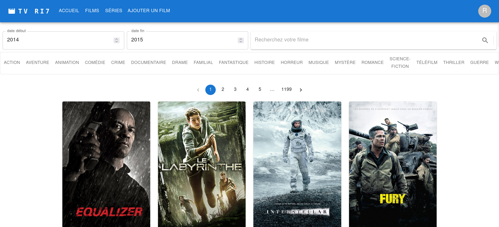

# Liste de Films (Movie List)


## About

The "Liste de Films" project is a React-based web application for managing a list of movies. I developed this project during my training, particularly during my internship. This project represents my first experience with React. It utilizes the ["dbMovie" API](https://developer.themoviedb.org/reference/intro/getting-started) to fetch movie data and create an interactive movie list.

**Material-UI** was used for the user interface, providing a modern and user-friendly design.

I've also implemented a search filter, allowing users to search for movies by year, genre, or directly by movie title.



[](https://whimsical-alfajores-0a8e7f.netlify.app/)

## Features

- **React**: The core framework used for building the application.
- **Material-UI**: A popular React UI framework for a modern user interface.
- **Axios**: A promise-based HTTP client for making API requests.
- **React Router Dom**: A routing library for managing different pages and views.
- **Emotion**: Styling libraries to enhance the look and feel of the application.
- **Testing Library**: Utilities for unit and integration testing.
- **Web Vitals**: Tools for monitoring the web application's performance.

## Getting Started

To set up this project on your local machine, follow these steps:

1. Clone this repository to your computer.

2. Install the project's dependencies using the following command:
   ```bash
   npm install
   
   ```

## Start the Development Server

To begin the development server, use the following commands:
   ```bash
   npm start
   ```

Access the application in your web browser via http://localhost:3000.

